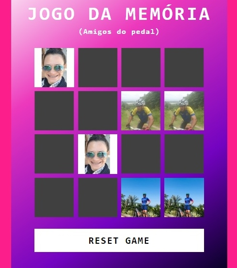

#JOGO DA MEMÓRIA

####Descrição

Um jogo de memória simples, desenvolvido usando apenas HTML, CSS e JavaCript.
O projeto faz parte das atividades do Bootcamp **Potência Tech iFood - Desenvolvimento de Jogos**, ministrado pela **Digital Innovation One** em parceria com o **Ifood**.
O projeto consiste em desenvolver o jogo utilizando emojis, mas cada aluno pode alterar da forma como achar melhor. 
Eu aproveitei para fazer uma brincadeira com os colegas do pedal e fiz o jogo com as imagens deles, me incluindo também, claro.. rsrs

Acesse o deploy do projeto [Aqui](https://bajan1408.github.io/jogo-da-memoria-com-js/)
